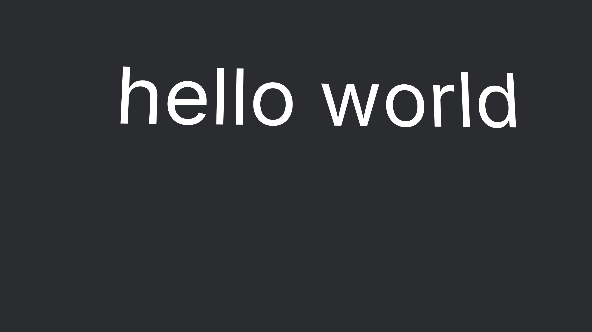

## Integrating to your Bevy App

Add to Cargo.toml:

```
[dependencies]
bevy_slugtext = "0.1.0"
```

Include the library:

```rust
use bevy_slugtext::prelude::*;
```

Second, add a `SlugTextPlugin` to your app:

```rust
App::new()
    ...
    .add_plugins(SlugTextPlugin)
    ...;

Then, spawn a textmesh bundle:

```rust
commands.spawn((
    TextMesh {
        text: "hello world".to_string(),
        font: asset_server.load("fonts/Inter.ttf"),
        color: Color::Srgba(Srgba::WHITE),
        size: 1.0,
        ..Default::default()
    },
    Transform::from_xyz(-2.5, 0.0, 0.0),
));
```